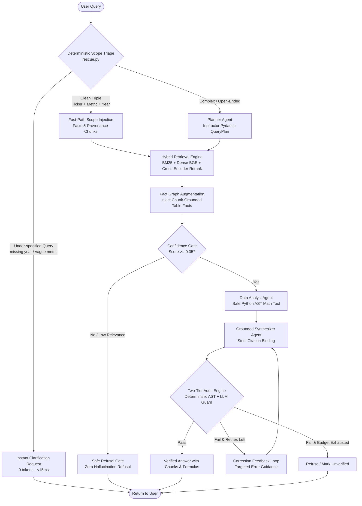

# System Architecture: Enterprise Agentic Graph RAG

> **Technical Reference & Engineering Specification**  
> *Author:* Venkat  
> *Core Deliverables:* [`rag-engine`](../rag-engine) (RAG Orchestrator), [`eval-harness`](../eval-harness) (Evaluation Harness), [`cockpit-ui`](../cockpit-ui) (Interactive Studio)

---

## 1. Executive Summary & The Problem Space

Standard Retrieval-Augmented Generation (RAG) architectures—consisting of naive text splitting, vector search, and a single LLM prompt—consistently fail when deployed against enterprise financial documents such as SEC Form 10-K filings.

```
+-----------------------------------------------------------------------------------+
|                       Why Naive / Baseline RAG Fails on 10-Ks                      |
+-----------------------------------------------------------------------------------+
| 1. Tabular Blindness: Financial statements (Balance Sheet, Income Statement, Cash |
|    Flows) span multi-column grids. Arbitrary chunking cuts rows from headers.      |
|                                                                                   |
| 2. Consolidated vs. Segment Confusion: A naive vector search matches "revenue"   |
|    chunks indiscriminately, frequently returning a segment table (e.g. AWS or     |
|    Family of Apps) instead of consolidated corporate revenue.                     |
|                                                                                   |
| 3. Mental Math Hallucinations: LLMs cannot perform reliable multi-step arithmetic |
|    (YoY delta, CAGR, operating margin percentage gaps) in their attention heads.  |
|                                                                                   |
| 4. Silent Guessing: When an ambiguous or unanswerable question is asked, standard |
|    pipelines hallucinate plausible-sounding figures rather than asking for scope. |
+-----------------------------------------------------------------------------------+
```

This system addresses these structural flaws through a **Neuro-Symbolic Agentic Architecture**: combining deterministic semantic scope triage and verifiable fact graphs with LangGraph multi-agent orchestration, sandboxed Python AST mathematical computation, and a calibrated evaluation harness.

---

## 2. End-to-End Query Lifecycle



---

## 3. The 5 Core Architectural Pillars

### Pillar 1: Table-Aware Ingestion & Typed Fact Graph
- **Table Parsing:** SEC 10-K HTML tables are parsed into structured Markdown grids. Column header years (e.g. `2025`, `2024`, `2023`) are extracted and aligned with row items to prevent cross-column contamination.
- **Typed Fact Graph (`financial_graph.json`):**
  - **Nodes:** `Company`, `Filing`, `FinancialMetric`, `MetricValue`, `Chunk`.
  - **Edges:** `REPORTS`, `HAS_METRIC`, `RECORDED_IN`, and critically, `PROVENANCE_CHUNK`.
  - Every extracted fact carries the immutable chunk ID of the exact source table passage from which it was extracted.

```
(Company: Apple) ──[:REPORTS]──> (Filing: AAPL_2025_10K)
                                           │
                                    [:RECORDED_IN]
                                           ▼
(Metric: Net Sales) <──[:HAS_METRIC]── (MetricValue: $391,036M)
                                           │
                                 [:PROVENANCE_CHUNK]
                                           ▼
                                (Chunk: AAPL_2025_10K:Item8:c002)
```

### Pillar 2: Neuro-Symbolic Scope Triage (`rescue.py`)
Rather than paying LLM token latency and cost for clean factual lookups, the system applies a deterministic triage router:
1. **Scope Extraction:** Extracts `(ticker, metric, fiscal_year)` without LLM calls.
2. **Instant Disambiguation:**
   - Missing fiscal year for multi-year filers $\to$ clarifies valid filing years (`FY2023`, `FY2024`, `FY2025`).
   - Vague metric (e.g., *"profit margin"*) $\to$ prompts whether the user requires Gross Margin, Operating Margin, or Net Profit Margin.
   - Missing comparison cohort (e.g., *"relative to peers"*) $\to$ prompts for the explicit competitor ticker list.
3. **Fallback to Neural Planning:** Any query with complex semantic qualifiers (e.g., *"Why did cloud gross margins compress?"*) safely bypasses triage and falls through to the LLM planner.

### Pillar 3: LangGraph Multi-Agent Orchestrator (`orchestrator.py`)
State transitions are governed by an explicit LangGraph state machine:
- **`plan`:** Generates structured sub-questions with required metadata filters.
- **`retrieve`:** Executes multi-query parallel hybrid search (BM25 + dense embeddings) fused via Reciprocal Rank Fusion (RRF), re-scored via BGE Cross-Encoder.
- **`analyze`:** Detects arithmetic intents (YoY delta, margins, CAGR, share of totals) and executes them deterministically.
- **`synthesize`:** Grounds generated narrative in retrieved chunk IDs.
- **`audit`:** Enforces citation validity and numerical equivalence.
- **`retry`:** Cyclic feedback edge routing back to `synthesize` when citations are invalid or figures cannot be grounded.

### Pillar 4: Safe Python Mathematical Execution (`math_tool.py`)
LLMs are never permitted to generate final financial calculations in freeform text.
- Mathematical expressions are extracted into structured formulas.
- Formulas are parsed into an Abstract Syntax Tree (`ast.parse`) in an isolated, sandboxed environment prohibiting imports, file I/O, or dynamic code execution.
- Computed figures (`raw_value`, `formatted`) are injected into the synthesis context and registered in `derived_values` for downstream audit verification.

### Pillar 5: DeepEval Proving Ground & Calibrated Evaluation (`p1-eval-harness`)
Evaluations rely on a two-tier verification harness:
1. **Deterministic Verification:** AST number matching against cited chunk text with unit scaling tolerance ($M vs $B) and exact refusal scoring on unanswerables.
2. **Calibrated G-Eval Judge:** Semantic correctness evaluated by a frontier model (`openai/gpt-5.6-luna`) calibrated against human-labeled golden sets:
   - **Human Agreement:** **88.5%** (46/52)
   - **Cohen's Kappa:** **$\kappa = 0.723$** (Substantial Agreement)
   - **DeepEval Metrics:** Faithfulness (claim support) and Answer Relevancy.

---

## 4. Domain Portability: Pluggable Skill Packs

The core orchestration engine in [`ragfilings.pipeline`](../rag-engine/src/ragfilings/pipeline) is 100% domain-agnostic. All domain-specific logic conforms to the abstract [`DomainPack`](../rag-engine/src/ragfilings/domains/__init__.py) contract:

| Pack Hook | Financial (`financial`) | Legal Contracts (`legal`) | Biomedical (`biomedical`) |
| :--- | :--- | :--- | :--- |
| **Corpus** | SEC 10-K Filings (25 filers) | Commercial Contracts (CUAD, LegalBench) | PubMedQA & NCBI PubChem |
| **Fact Layer** | Typed table fact graph with provenance | Defined-term index (913 terms) | Scientific sections & MeSH terms |
| **Derivation Tool**| Safe Python Financial Calculator | Clause extraction & quote verifier | Live NCBI PubChem PUG-REST API |
| **Claim Auditor** | Monetary & percentage unit scaling | Verbatim contractual clause matching | Clinical dosages, $p$-values, $n$ sizes |

---

## 5. Enterprise Scaling Blueprint (From Local to Production)

To transition this architecture from a single-node system (25 filings) to an enterprise-wide index covering tens of thousands of corporate filers:

```
[Enterprise Ingestion]
SEC EDGAR XBRL API ──▶ Kafka Stream ──▶ Celery Worker Pool ──▶ Document Normalizer
                                                                       │
                                              ┌────────────────────────┴────────────────────────┐
                                              ▼                                                 ▼
                                     [Hybrid Vector Store]                             [Property Graph]
                                      Qdrant / pgvector                                     Neo4j
                              (Dense Embeddings + Sparse BM25)                     (Entities & Provenance)
                                              │                                                 │
                                              └────────────────────────┬────────────────────────┘
                                                                       ▼
                                                       [LangGraph Distributed Runtime]
                                                          FastAPI + Redis Streams
                                                                       │
                                                       [OpenTelemetry / Tracing Layer]
                                                          LangSmith / Arize Phoenix
```

1. **Storage Layer Migration:**
   - Replace in-memory NumPy embeddings with **Qdrant** or **PostgreSQL + pgvector** utilizing HNSW indexing and metadata filtering by `ticker` and `fiscal_year`.
   - Migrate `financial_graph.json` to **Neo4j** with Cypher queries for multi-hop entity traversal.
2. **SEC Ingestion Pipeline:**
   - Ingest native **inline-XBRL (iXBRL)** directly from SEC EDGAR. XBRL tags provide official taxonomy tags (`us-gaap:Revenues`, `us-gaap:NetIncomeLoss`), eliminating table parsing ambiguity.
3. **Async Task Execution & Streaming:**
   - Wrap LangGraph workflows in **Temporal** or **Celery + Redis** to handle long-running batch evaluation and multi-turn concurrent user sessions with OpenTelemetry tracing.
