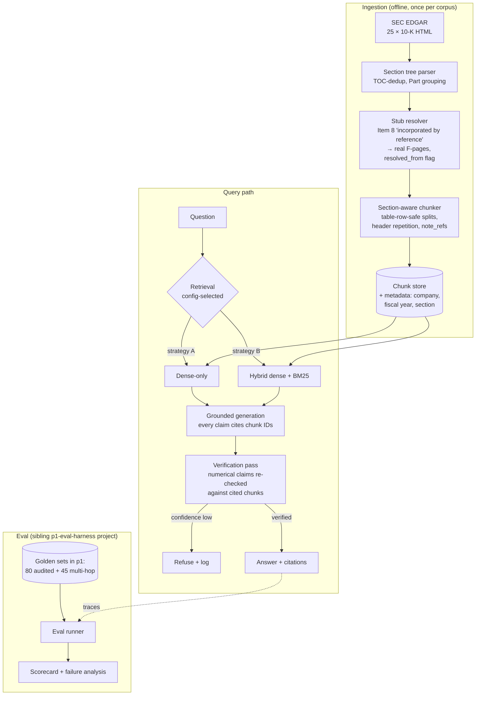

# Architecture — one page, honest about tradeoffs

## Tradeoffs made deliberately

| Decision | What we gained | What it costs |
|---|---|---|
| Header-based section parsing + stub resolution (not an HTML-layout model) | Simple, debuggable, zero ML deps | Breaks on filings with exotic structures; JPM needed special handling |
| Chunking never splits table rows; headers repeated per chunk | Table questions actually answerable | Bigger chunks → more tokens per query |
| Verification pass re-checks numbers before answering | Catches wrong-column/wrong-year errors — our #1 failure class | Adds one model call of latency per numerical answer |
| Confidence-gated refusal | Low hallucination rate on unanswerable questions | Some answerable questions get refused (measured, reported) |
| Two retrieval strategies behind one config flag | The comparison is publishable content | Neither is tuned to its individual ceiling |

## What v1 does not attempt (with a hypothesis)

Multi-hop / agentic retrieval. Hypothesis: it would fix cross-filing synthesis
failures (e.g., comparing two companies' figures in one question) at roughly 2–3×
the cost per query. Documented in the failure analysis when we ship it.
